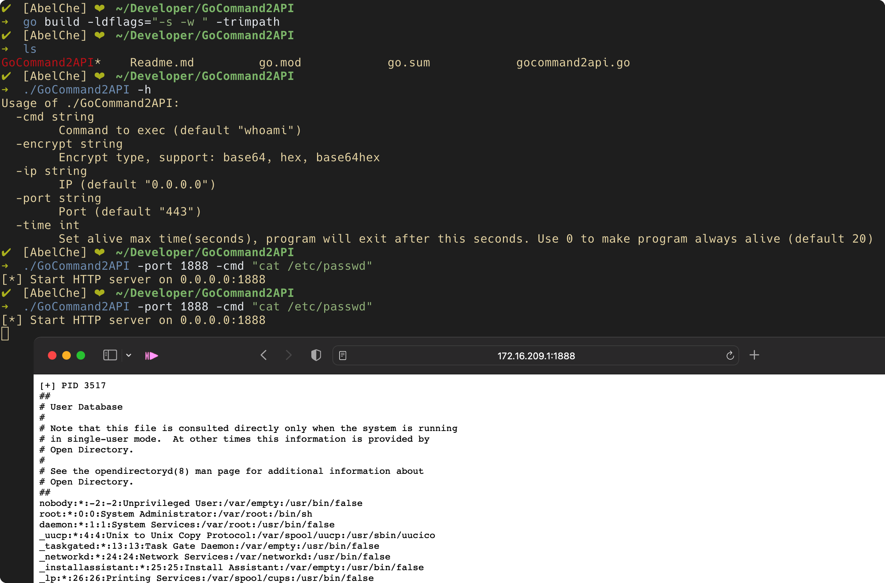
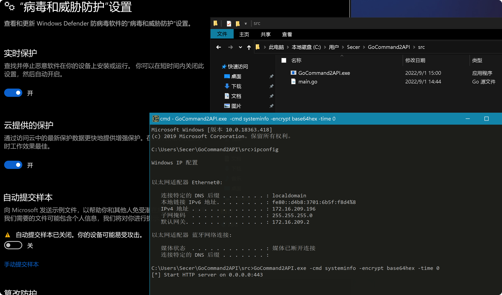
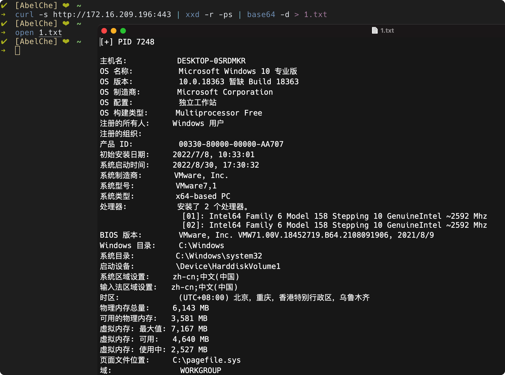

# GoCommand2API

灵感来源：https://github.com/gh0stkey/Command2API

> 本项目是用Go实现的Command2API，故起名为GoCommand2API

## 🧬 编译

```sh
git clone https://github.com/AbelChe/GoCommand2API.git
cd GoCommand2API

go build -ldflags="-s -w " -trimpath
```

go直接编出来的大小能有4兆多

可以再用upx压缩，大概不到2兆

```
upx GoCommand2API.exe
```


## 💨使用

`-h`参数获取帮助

```sh
./GoCommand2API -h
Usage of ./GoCommand2API:
  -cmd string
    	Command to exec (default "whoami")
  -encrypt string
    	Encrypt type, support: base64, hex, base64hex
  -ip string
    	IP (default "0.0.0.0")
  -port string
    	Port (default "443")
  -time int
    	Set alive max time(seconds), program will exit after this seconds. Use 0 to make program always alive (default 20)
```

```sh
# 默认执行whoami，打开443端口
./GoCommand2API

# 使用-port参数修改http端口
./GoCommand2API -port 8888

# 使用-cmd参数修改执行的命令
./GoCommand2API -cmd "cat /etc/passwd"

# 使用-encrypt参数选择加密方式
./GoCommand2API -encrypt base64

# 使用-time参数选择执行时长，此举是为了防止执行之后万一无法通过其他方式结束进程导致端口占用等情况，默认为20即启动20秒后自动结束进程，当设置为0的时候，程序将不会自行退出，只能通过kill pid或者手动^c结束进程
./GoCommand2API -time 20

# 参数-ip指定监听ip，默认0.0.0.0，一般无需修改
./GoCommand2API -ip 0.0.0.0
```




## Bypass AV

defender无感



